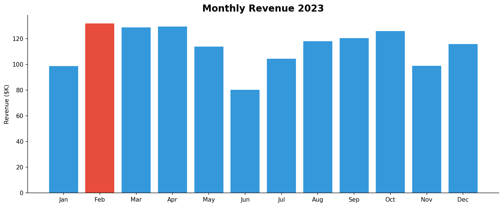

# Sales Data Analysis 2023

## Executive Summary
This project analyzes 1,000 retail sales transactions from 2023 to understand
monthly revenue trends, category performance, regional differences, and discount
impact using Python and pandas.

## Dashboard Preview


## Project Goal
Answer key business questions:
- Which month had the highest revenue?
- Which product category drives the most sales?
- What is the average order value by region?
- How do discounts impact revenue?

## Tools Used
| Tool | Purpose |
|------|---------|
| Python | Data generation, cleaning, analysis |
| pandas | Data manipulation and aggregation |
| matplotlib | Data visualization |
| Git & GitHub | Version control and documentation |

## Dataset Overview
Synthetic retail dataset with 1,000 transactions across 2023.

| Field | Description |
|-------|-------------|
| order_id | Unique order identifier |
| date | Order date (2023) |
| region | North, South, East, West |
| category | Electronics, Clothing, Food & Beverage, Furniture, Sports |
| unit_price | Price per unit |
| quantity | Units ordered |
| discount | Discount applied (0 to 20%) |
| revenue | Final revenue after discount |

## Key KPIs
| KPI | Value |
|-----|-------|
| Total Revenue | $1,367,568 |
| Total Orders | 1,000 |
| Avg Order Value | $1,367 |
| Top Category | Electronics |
| Peak Month | February |

## Project Structure
sales-data-analysis/
├── data/
│   ├── sales_data.csv
│   └── generate_data.py
├── notebooks/
│   └── sales_analysis.py
├── outputs/
│   ├── monthly_revenue.png
│   ├── revenue_by_category.png
│   ├── region_analysis.png
│   └── discount_impact.png
└── README.md

## Analysis Performed
1. **Monthly Revenue Trend** — identified peak and low months
2. **Revenue by Category** — compared 5 product categories
3. **Regional Analysis** — avg order value across 4 regions
4. **Discount Impact** — effect of discounts on avg revenue

## Business Insights
- Electronics drives 59% of total revenue due to high unit prices
- February was the peak revenue month
- North region leads with highest average order value
- Orders with no discount generate the highest average revenue

## Recommendations
- Invest more marketing budget in Electronics during Q1
- Investigate June revenue dip for potential causes
- Review discount strategy — higher discounts reduce avg revenue
- Focus growth efforts on the West region which underperforms

## How to Run
```bash
git clone https://github.com/Indra0719/sales-data-analysis.git
cd sales-data-analysis
pip install pandas matplotlib
python3 data/generate_data.py
python3 notebooks/sales_analysis.py
```

## Skills Demonstrated
- Python data analysis with pandas
- Data visualization with matplotlib
- Feature engineering (month extraction, discount calculations)
- Business insight generation
- GitHub project documentation
